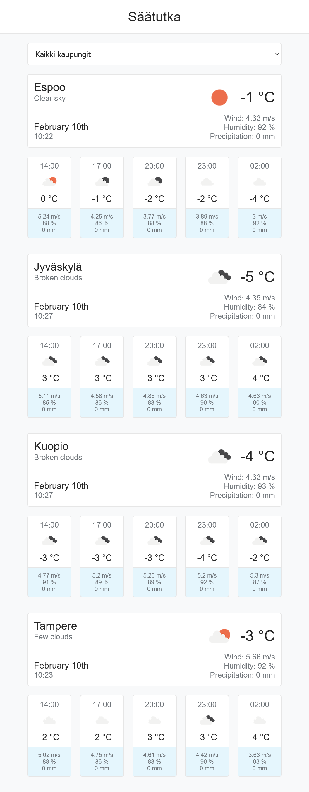
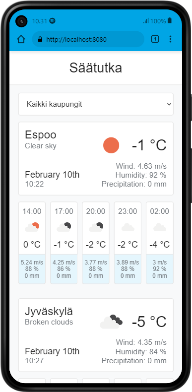
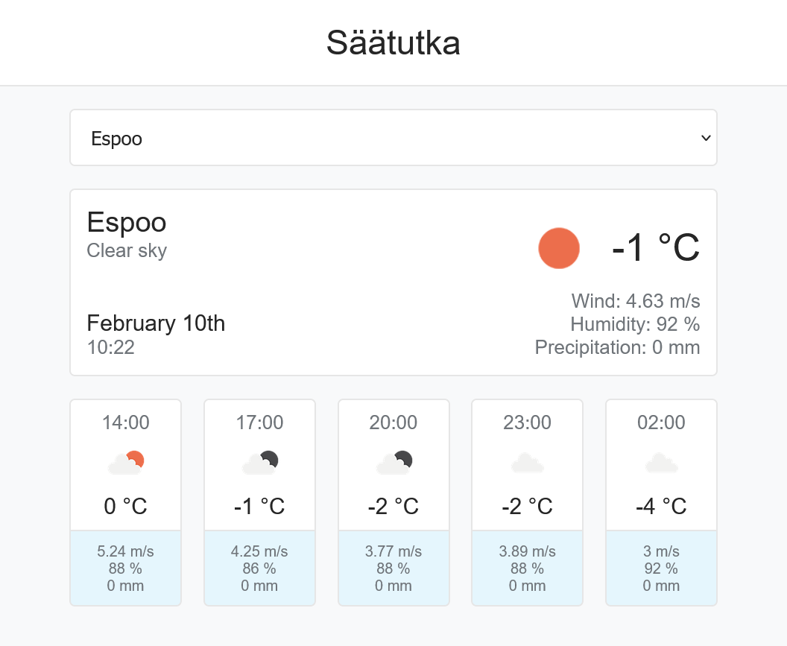

# Säätutka

Säätutka-sovellus esittää Espoon, Jyväskylän, Kuopion ja Tampereen säätiedot kuluvalla hetkellä sekä ennusteen kolmen tunnin välein. Sovelluksesta on nähtävissä:
- lämpötila
- tuulennopeus
- ilmankosteus
- sademäärä

Sovellus on toteutettu [Vue.js:llä](https://v2.vuejs.org/) ja säätiedot on haettu [OpenWeatherMapista.](https://openweathermap.org/)

---

Säätutka application presents the current weather data for Espoo, Jyväskylä, Kuopio and Tampere as well as the forecast for every three hours. From the application you can see:
- temperature
- wind speed
- humidity
- precipitation

The application has been made with [Vue.js](https://v2.vuejs.org/) and weather data has been retrieved from [OpenWeatherMap.](https://openweathermap.org/)





#### Before setup
Change your own OpenWeatherMap API key to __App.vue__ file on line 33.
```
...
31  data () {
32    return {
33      apiKey: 'YOUR_API_KEY'
...
```
#### Project setup
```
// Install the dependencies
npm install

// Compiles and hot-reloads for development
npm run serve

// Compiles and minifies for production
npm run build
```

#### Customize configuration
See [Configuration Reference](https://cli.vuejs.org/config/).

